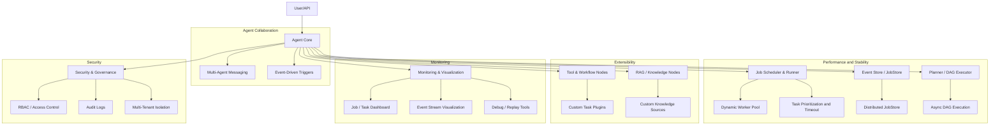
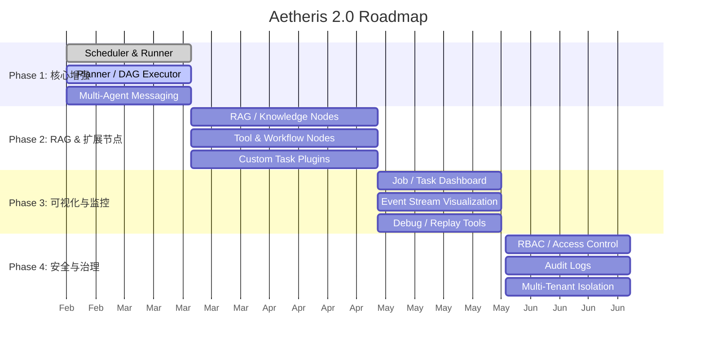
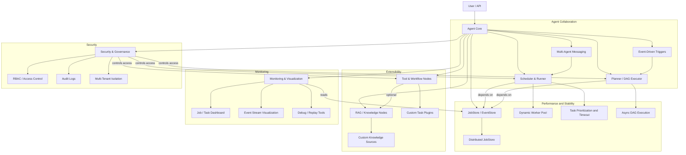
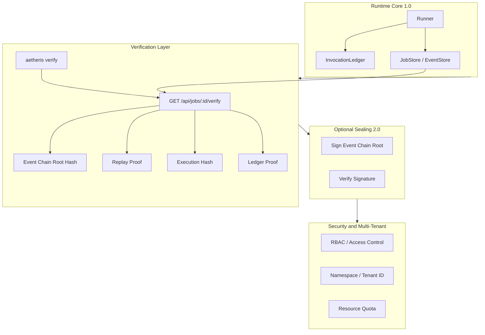

# Aetheris 2.0 — 功能模块与 Roadmap

本文档描述 Aetheris 2.0 的功能模块结构和高阶 Roadmap 时间线。执行语义与 1.0 运行时（Ledger、JobStore、Runner）的对应关系见 [runtime-core-diagrams.md](runtime-core-diagrams.md) 与 [1.0-runtime-semantics.md](1.0-runtime-semantics.md)。

---

## 1. 2.0 功能模块结构图

---

## 2. 2.0 高阶 Roadmap 时间线

| 阶段       | 时间     | 主要目标              | 关键模块                                                                |
| ---------- | -------- | --------------------- | ----------------------------------------------------------------------- |
| **阶段 1** | 1–2 个月 | 核心执行增强、多 Agent 支持 | Job Scheduler & Runner, Planner/DAG Executor, Multi-Agent Messaging     |
| **阶段 2** | 2–3 个月 | RAG 集成 & 扩展节点   | RAG / Knowledge Nodes, Tool & Workflow Nodes, Custom Task Plugins       |
| **阶段 3** | 2 个月   | 监控与可视化          | Monitoring & Visualization, Event Stream, Debug Tools                   |
| **阶段 4** | 1–2 个月 | 安全与治理            | Security & Governance, RBAC, Audit, Multi-Tenant                        |

---

## 3. 2.0 总览整合图（模块 + 依赖 + 阶段）

### 3.1 Roadmap 甘特图

下图展示 2.0 各阶段与时间线。

### 3.2 模块依赖结构图

下图展示模块间依赖与扩展、监控、安全关系。

---

## 4. 2.0 可证明性栈与架构升级图

在 1.0 Runtime 核心（Runner–Ledger–JobStore）之上，2.0 强化**可证明性**：先落地 Verification 层，再延伸事件链密封与安全/多租户边界。

- **Runtime Core**：Runner、Ledger、JobStore 构成 1.0 执行与 at-most-once 保证。
- **Verification Layer**：只读校验与摘要；Verify API/CLI 输出 execution_hash、event_chain_root_hash、ledger proof、replay proof（见 [verification-mode.md](verification-mode.md)）。
- **Optional Sealing**：事件链根 hash 可选私钥签名、公钥校验（2.0 延伸，见 [event-chain-sealing.md](event-chain-sealing.md)）。
- **Security and Multi-Tenant**：Phase 4 能力边界（RBAC、Namespace、Quota）。

---

- **功能模块详图**：见上文 §1。
- **1.0 执行流与 StepOutcome**：[runtime-core-diagrams.md](runtime-core-diagrams.md)
- **1.0 运行时语义与 Ledger 状态机**：[1.0-runtime-semantics.md](1.0-runtime-semantics.md)
- **Verification Mode**：[verification-mode.md](verification-mode.md)
- **2.0 能力矩阵**：[docs/2.0-capability-matrix.md](../docs/2.0-capability-matrix.md)
