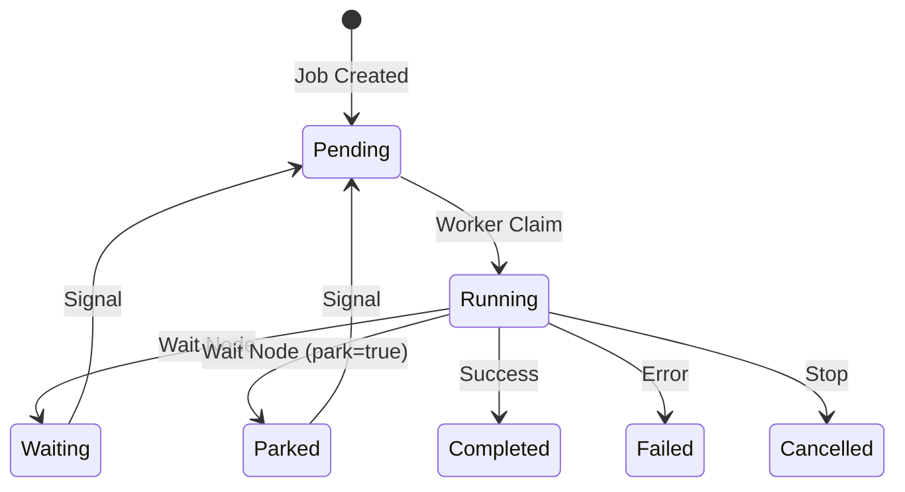

# Agent as Process — Agent 即虚拟进程

Aetheris 将 Agent Job 视为**虚拟进程**（virtual process），而非一次性任务。Worker 是进程调度器（process scheduler），不拥有 process；Process 可 pause、wait、receive messages、resume across different workers。

这是 Aetheris 从"任务队列"到"Agent Runtime"的核心语义转变。

---

## 核心概念

### Agent Job = Virtual Process

与操作系统 process 类比：

| OS Process | Aetheris Agent Job |
|------------|-------------------|
| **PID** | job_id |
| **执行状态** | 事件流（event stream）|
| **内存** | payload.Results（agent memory）|
| **指令指针** | cursor_node（execution pointer）|
| **等待队列** | agent_message 事件（mailbox）|
| **进程表** | JobStore metadata |
| **信号** | job_waiting / wait_completed（signal/resume）|

**关键差异**：
- OS process 由 CPU 执行；Agent process 由 Worker 调度执行
- OS process 在单机；Agent process 可跨 Worker（分布式）
- OS process 崩溃 = 进程终止；Agent process 崩溃 = 从 checkpoint 恢复

---

## Worker = Process Scheduler

Worker 不是"任务执行器"（task executor），而是"进程宿主"（process host）/ 进程调度器（process scheduler）：

| 任务队列模式（传统） | Process Runtime（Aetheris） |
|----------------|--------------------------|
| Worker 拥有 task | Worker 调度 process，不拥有 |
| Task 完成 = 释放 | Process wait = 释放，signal = 恢复 |
| 一次性执行 | 长期存在，可暂停/恢复 |
| 状态在 Worker | 状态在事件流 + checkpoint |

**Worker 行为**：

```go
for {
    // 1. 调度：从可执行 process 中选一个
    job := ClaimNextPending()
    
    // 2. 加载：从 checkpoint/event stream 恢复 process 状态
    state := LoadProcessState(job)
    
    // 3. 执行：运行到下一个 wait 点或完成
    RunForJob(job, state)
    
    // 4. 释放：若 wait/complete，Worker 与 process 断连
    // Process 仍"活着"（状态在 event stream），等待 signal 唤醒
}
```

**关键**：Worker 无状态，Process 有状态（event-sourced）。

---

## 进程状态机



**状态语义**：

| 状态 | 类比 OS | Worker 行为 | 恢复方式 |
|------|---------|-------------|----------|
| **Pending** | Ready queue | 可被 claim 调度 | Scheduler poll 或 WakeupQueue |
| **Running** | Running | Worker 执行中 | Heartbeat 续租 |
| **Waiting** | Blocked (短暂) | Worker 释放；Scheduler 仍扫描（兜底） | Signal 或 poll |
| **Parked** | Swapped out | Worker 释放；Scheduler 跳过 | 仅 Signal（必须配置 WakeupQueue） |
| **Completed** | Exited (0) | Process 终止 | (无) |
| **Failed** | Exited (non-0) | Process 终止 | (无) |

---

## IPC / Mailbox

### agent_message = IPC

Agent 有虚拟"收件箱"（event stream 中的 `agent_message` 事件）：

```json
{
  "message_id": "msg-123",
  "channel": "approvals",
  "correlation_key": "approval-456",
  "payload": {"approved": true}
}
```

**语义**：
- **投递**：POST `/api/jobs/:id/message` 写入 `agent_message` 到事件流
- **消费**：Wait 节点 `wait_type=message`、`channel=approvals` 时，Runner 读取匹配 channel 的消息，写 `wait_completed` 并继续
- **持久化**：消息在事件流中永久保存；未来可扩展"已消费消息 ID"避免重复消费

**类比**：
- OS: `send(pid, message)` / `recv(channel)`
- Aetheris: POST `/api/jobs/:id/message` / Wait(wait_type=message, channel=...)

---

## Signal / Resume

### wait_completed = SIGCONT

`wait_completed` 不是"unblock"，而是"process resume signal"：

```json
{
  "node_id": "wait1",
  "correlation_key": "approval-123",
  "payload": {"approved": true}  // signal 传入的数据
}
```

**语义**：
- Wait 节点写 `job_waiting`（含 resumption_context）
- Signal 写 `wait_completed`（含 signal payload）
- Runner 恢复时：resumption_context.payload_results + signal.payload → 下一步的 input
- Process 从 wait 点继续，不是"从头执行"或"重新规划"

**类比**：
- OS: Process blocked on I/O → kernel 唤醒 → 继续执行
- Aetheris: Agent wait → signal → Worker claim → 从 wait 点继续

---

## Checkpoint = Process Snapshot

Checkpoint 不是"保存进度"，而是"进程快照"（process snapshot）：

```go
Checkpoint {
    PID:           job_id
    IP:            cursor_node        // 指令指针
    Memory:        payload_results    // 进程内存
    TaskGraph:     task_graph_state   // 执行代码（Plan）
    SessionID:     session_id         // 会话上下文
}
```

**语义**：
- 每步完成后写 Checkpoint（类比 OS checkpoint/restore）
- 崩溃后从最近 Checkpoint 恢复（restore process from snapshot）
- Replay 时可从任意 Checkpoint 开始（time-travel debugging）

**类比**：
- OS: fork() → child process snapshot
- Aetheris: 每步 → checkpoint → 崩溃后 restore

---

## Parked = Swapped Out

StatusParked 类比 OS 的"swap out"（换出到磁盘）：

| OS Swap | Aetheris Parked |
|---------|-----------------|
| 长时间不活跃 process 换出 | 长时间等待 job 不占调度资源 |
| 节省内存 | 节省 Scheduler 扫描开销 |
| 需要时 swap in | Signal 唤醒后置为 Pending |

**场景**：
- 1000 个 Agent 等待人工审批（3 天）
- 若都是 StatusWaiting，Scheduler 每次 poll 都扫描 1000 个（浪费）
- StatusParked：Scheduler 跳过；signal 后通过 WakeupQueue 立即唤醒

---

## 对比：任务队列 vs Process Runtime

| 维度 | 任务队列（Celery, Sidekiq） | Process Runtime（Aetheris） |
|------|---------------------------|---------------------------|
| **抽象** | Task（一次性） | Process（长期存在） |
| **执行** | Worker 拥有 task | Worker 调度 process |
| **状态** | 在 Worker 内存 | 在事件流（event-sourced） |
| **等待** | Task 阻塞 Worker | Process 释放 Worker，等待 signal |
| **恢复** | 重新执行 | 从 checkpoint 继续 |
| **通信** | Queue message | IPC / Mailbox |
| **审计** | 日志 | Event stream（不可变） |

---

## 为什么这很重要？

### 场景 1：人工审批（3 天）

**任务队列**：
```
Task: 等待审批
→ Worker 阻塞 3 天（浪费）或超时失败
```

**Process Runtime**：
```
Process: Wait(correlation_key="approval-123") → StatusParked
→ Worker 释放，Process "睡眠"
→ 3 天后 signal → Process 唤醒 → 任意 Worker 继续
```

---

### 场景 2：多步推理（2 小时）

**任务队列**：
```
Task A → Task B → Task C
→ 每个 task 独立，状态通过 Redis/DB 传递
→ Task B 失败 → 重新执行 Task A（浪费）
```

**Process Runtime**：
```
Process: Plan(A → B → C) → 执行 A → Checkpoint → 执行 B → 失败
→ 崩溃恢复：从 Checkpoint 继续（A 不重新执行）
→ Replay: 注入已记录结果，确定性重放
```

---

### 场景 3：外部副作用（at-most-once）

**任务队列**：
```
Task: send_email
→ 失败重试 → 发送两次（客户收到两封邮件）
```

**Process Runtime**：
```
Process: Tool(send_email, idempotency_key="job:step:attempt")
→ Tool Ledger: 同一 key 最多执行一次
→ 崩溃重试 → Replay 注入已记录结果，不重发
```

---

## 实现映射

| Process 概念 | Aetheris 实现 | 文件 |
|-------------|--------------|------|
| Process ID | job_id | internal/agent/job/job.go |
| Process State | event stream | internal/runtime/jobstore/event.go |
| Process Memory | payload.Results | internal/agent/runtime/executor/runner.go |
| Process Scheduler | Worker poll + claim | internal/app/worker/agent_job.go |
| Process Snapshot | Checkpoint | internal/agent/runtime/checkpoint.go |
| IPC / Mailbox | agent_message | internal/runtime/jobstore/event.go |
| Signal | wait_completed | internal/api/http/handler.go (JobSignal) |
| Swap out | StatusParked | internal/agent/job/job.go |

---

## 参考

- [agent-process-model.md](agent-process-model.md) — Signal, Query, Mailbox, Continuation
- [execution-guarantees.md](execution-guarantees.md) — Runtime 保证
- [runtime-contract.md](runtime-contract.md) — Blocking, 租约, Execution Epoch
- [checkpoint-barrier.md](checkpoint-barrier.md) — Checkpoint 语义
