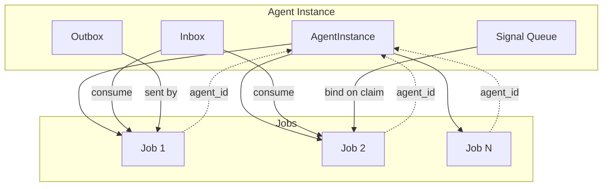

# Agent Instance 数据模型（AgentInstance Layer）

本文档定义 Aetheris 2.0 的 **Agent Instance** 作为第一公民的持久化模型，包括 Instance 实体、Inbox/Outbox、Signal Queue 的语义与存储约定，以及与现有 Job 的关系与迁移路径。与 [agent-as-process.md](agent-as-process.md)、[agent-process-model.md](agent-process-model.md) 的进程语义一致。

---

## 1. 目标

- **稳定身份**：`agent_id` 对应一个持久化的 Agent Instance，而非仅作为 Job 的外键。
- **多 Job 持续上下文**：一个 Instance 下可有多个 Job、多次交互，状态与人格可跨 Job 恢复。
- **消息驱动**：支持「由 inbox 驱动创建或绑定 Job」，而不仅是「每次用户请求创建新 Job」。
- **Inbox / Outbox / Signal Queue**：Agent 级收件箱、发件记录、待消费信号队列，与 Job 级 signal 并存。

---

## 2. 核心实体

### 2.1 AgentInstance

Agent Instance 是长期存在的计算实体（虚拟进程的「身份」），对应一个 `agent_id`。

| 字段 | 类型 | 必填 | 说明 |
|------|------|------|------|
| `id` | string | 是 | 与 `agent_id` 一致，全局唯一 |
| `tenant_id` | string | 否 | 多租户隔离；空表示默认租户 |
| `name` | string | 否 | 可读名称 |
| `status` | string | 是 | 见下表 Instance 状态 |
| `default_session_id` | string | 否 | 默认会话 ID；创建 Job 时若未指定 session 则使用 |
| `created_at` | timestamp | 是 | 创建时间 |
| `updated_at` | timestamp | 是 | 最后更新时间 |
| `meta` | JSON | 否 | 扩展元数据（配置、标签等） |

**Instance 状态（status）**：

| 值 | 含义 |
|----|------|
| `idle` | 无运行中 Job，可被调度 |
| `running` | 至少有一个 Job 处于 Running |
| `waiting` | 至少有一个 Job 处于 Waiting（短暂等待） |
| `parked` | 至少有一个 Job 处于 Parked（长时间等待）；或无 Job 但有待消费的 delayed message |
| `failed` | 可选：最近一次执行失败，用于告警或降级 |

状态可由该 Instance 下所有 Job 的状态推导（如 `running` = 存在 StatusRunning 的 Job），或由 Runner/API 在 Claim/Complete 时更新 Instance 状态。

### 2.2 与现有数据的关系

- **jobs.agent_id** → **AgentInstance.id**：每个 Job 归属一个 Instance；现有表 `jobs` 的 `agent_id` 保持不变，语义上指向 AgentInstance。
- **agent_states(agent_id, session_id)**：仍按 agent 维度存会话快照；`agent_id` = AgentInstance.id，无需改表结构，仅约定「Session 属于某 Instance」。

---

## 3. 存储与接口约定

### 3.1 表结构（PostgreSQL 示例）

```sql
CREATE TABLE IF NOT EXISTS agent_instances (
    id                     TEXT PRIMARY KEY,
    tenant_id              TEXT,
    name                   TEXT,
    status                 TEXT NOT NULL DEFAULT 'idle',
    default_session_id      TEXT,
    created_at             TIMESTAMPTZ NOT NULL DEFAULT now(),
    updated_at             TIMESTAMPTZ NOT NULL DEFAULT now(),
    meta                   JSONB
);

CREATE INDEX IF NOT EXISTS idx_agent_instances_tenant_id ON agent_instances (tenant_id);
CREATE INDEX IF NOT EXISTS idx_agent_instances_status ON agent_instances (status);
```

### 3.2 AgentInstanceStore 接口

设计文档约定以下接口（实现可落在 `internal/agent/instance/` 或等价包）：

```go
// AgentInstance 持久化实体（与上表对应）
type AgentInstance struct {
    ID                 string
    TenantID           string
    Name               string
    Status             string
    DefaultSessionID   string
    CreatedAt          time.Time
    UpdatedAt          time.Time
    Meta               map[string]any
}

type AgentInstanceStore interface {
    Get(ctx context.Context, agentID string) (*AgentInstance, error)
    Create(ctx context.Context, instance *AgentInstance) error
    UpdateStatus(ctx context.Context, agentID, status string) error
    Update(ctx context.Context, instance *AgentInstance) error
    ListByTenant(ctx context.Context, tenantID string, limit int) ([]*AgentInstance, error) // 可选
}
```

- **Get**：按 agent_id 查询；若不存在可返回 nil（兼容「仅 Job、无 Instance」的 1.0 模式）。
- **Create**：创建新 Instance；可由 API 在首次 POST message 或注册 Agent 时调用。
- **UpdateStatus**：在 Job 状态迁移时更新 Instance 聚合状态（可选，也可由查询时推导）。

---

## 4. Instance 级 Inbox / Outbox / Signal Queue

### 4.1 Inbox（逻辑模型）

- **语义**：发往该 Agent 的消息队列；未被消费的消息按 `to_agent_id` 归属，投递时写入，消费时与某 Job 绑定并标记已消费。
- **存储**：可与 [agent-messaging-bus.md](agent-messaging-bus.md) 中的 `agent_messages` 表统一：`to_agent_id`、`delivered_at`（投递时间）、`consumed_by_job_id`（被哪次 Job 消费，空表示未消费）。
- **读/写接口约定**：
  - `AppendToInbox(ctx, toAgentID, message)`：投递一条消息到 Agent 的 inbox。
  - `PeekInbox(ctx, agentID, limit)` 或 `ConsumeInbox(ctx, agentID, limit)`：读取未消费消息；消费时设置 `consumed_by_job_id` 与可选 `consumed_at`，避免重复消费。

**与「创建 Job」的流程**：

1. **现有方式（保留）**：用户 POST `/api/agents/:id/message` → 创建 Job，Goal = message，Job 执行时处理该条消息。
2. **Inbox 驱动方式（2.0 扩展）**：消息先 `AppendToInbox(ctx, agentID, msg)`；Scheduler 或 API 发现该 Agent 的 inbox 非空时，可创建新 Job（Goal 取自消息或固定「process inbox」），Job 执行时调用 `ConsumeInbox` 取消息并处理；或已有 Parked/Waiting Job 时，将消息与现有 Job 关联（如写入该 Job 的事件流 `agent_message`），再唤醒 Job。

文档中仅约定「Inbox 读写」与「创建/绑定 Job」的上述两种路径；具体是「每个 message 一个 Job」还是「一个 Job 处理多条 message」由产品与实现决定。

### 4.2 Outbox（逻辑模型）

- **语义**：该 Agent 发出的消息（如 send(agentA→agentB)）；用于审计与追溯。
- **存储**：可选表 `agent_message_sends`：`id`、`from_agent_id`、`to_agent_id`、`channel`、`payload`（JSON）、`created_at`、可选 `job_id`（发出时所在的 Job）。
- **接口**：`AppendToOutbox(ctx, fromAgentID, toAgentID, channel, payload, jobID)`（可选）；由 Messaging Bus 在 Send 时调用。

### 4.3 Signal Queue（逻辑模型）

- **语义**：与当前「Job 级 signal」并存。Agent 级 signal 表示「未绑定到具体 job_id 的 signal」，在以下时机之一与 Job 绑定：
  - 该 Agent 下次被调度（Claim 到某 Job）时，将 pending signal 作为输入或 context 注入该 Job；
  - 或该 Agent 拉取 message 时，将 pending signal 与某条 message 一起绑定到新建或已有的 Job。
- **存储**：可选表 `agent_pending_signals`：`id`、`agent_id`、`correlation_key`、`payload`（JSON）、`created_at`、`consumed_by_job_id`（空表示未消费）。消费时与 Job 绑定并写入该 Job 的 `wait_completed` 或等价事件。
- **接口**：`EnqueueSignal(ctx, agentID, correlationKey, payload)`、`ConsumePendingSignals(ctx, agentID)`（返回并标记为已消费或与 job_id 绑定）。

---

## 5. 与 Job 的关系图



- 一个 **AgentInstance** 对应多个 **Job**（1:N）。
- **Inbox** 中的消息可驱动创建新 Job 或绑定到已有 Job（如 Waiting/Parked）。
- **Outbox** 记录该 Agent（某 Job）发出的消息。
- **Signal Queue** 中的 signal 在该 Agent 被调度或拉取时与某 Job 绑定。

---

## 6. 迁移路径

- **Phase 1（兼容）**：不强制创建 AgentInstance；现有 API 与 Worker 行为不变。若 `AgentInstanceStore.Get(ctx, agentID)` 返回 nil，可视为「仅 Job 模式」，不读写 Inbox/Outbox/Signal Queue。
- **Phase 2（双写）**：在 POST `/api/agents/:id/message` 或 Agent 注册时，若 Instance 不存在则 `Create`；同时保留「直接创建 Job」的路径。Inbox 表可先实现为「可选」：有则写入 inbox 并可由 Scheduler 按 inbox 创建 Job，无则仅创建 Job。
- **Phase 3（Inbox 驱动）**：支持「先 AppendToInbox，再由 Scheduler 或定时任务发现 inbox 非空并创建 Job」；以及 Agent 级 Signal Queue 的消费与 Job 绑定逻辑。

实现时建议先完成 AgentInstance 表与 AgentInstanceStore，再增加 Inbox 表与 Append/Consume 接口，最后再扩展 Outbox 与 Signal Queue 表及语义。

---

## 7. 参考

- [agent-as-process.md](agent-as-process.md) — Agent Job 即虚拟进程
- [agent-process-model.md](agent-process-model.md) — Signal、Mailbox、Query、Resume、WakeupQueue
- [agent-messaging-bus.md](agent-messaging-bus.md) — Message 表与 Send/Delayed 语义（与 Inbox 表可统一或对接）
