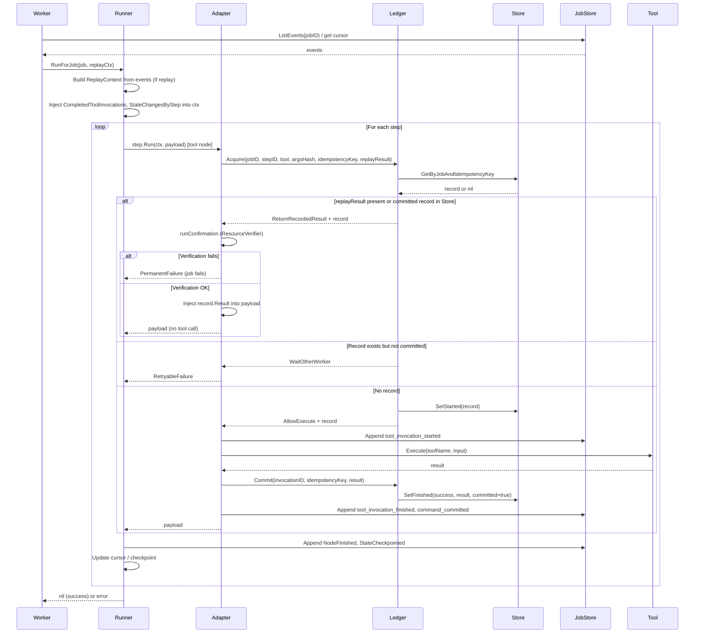

# Execution Proof — Runner ↔ Ledger ↔ JobStore ↔ Worker

Runner does not own tool execution; **Ledger is the only arbiter**. The tool is called only when Ledger returns `AllowExecute`. All other paths only read from Store or replay and inject results.

---

## Sequence diagram

---

See [1.0-runtime-semantics.md](1.0-runtime-semantics.md) for the three mechanisms (Tool Invocation Ledger, StepOutcome world semantics, Confirmation Replay) and the Execution Proof Chain section.
