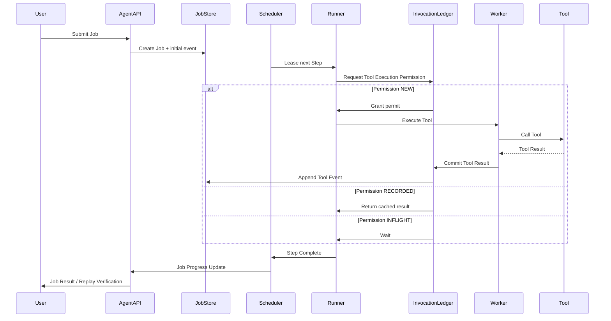
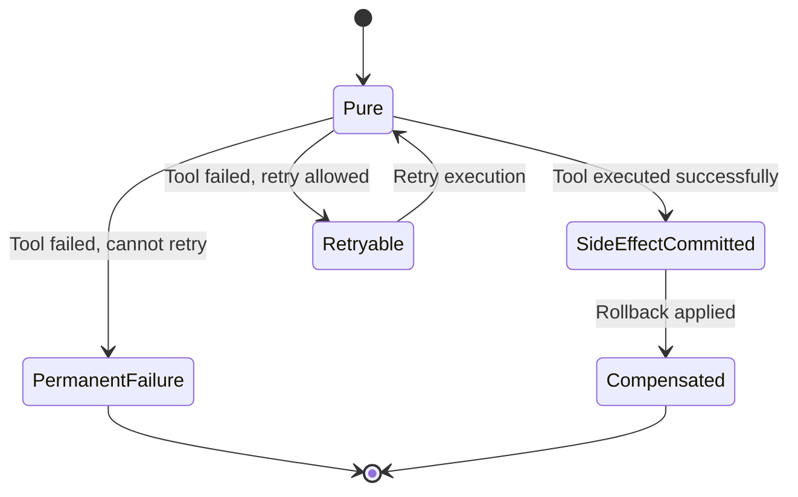

# Aetheris Runtime — Core sequence and StepOutcome

High-level execution flow and Step outcome world semantics. For the detailed execution-proof sequence (Adapter, Ledger Acquire/Commit, single tool path) see [execution-proof-sequence.md](execution-proof-sequence.md). For Ledger state machine and Confirmation Replay see [1.0-runtime-semantics.md](1.0-runtime-semantics.md).

---

## 1. Runner ↔ Ledger ↔ JobStore ↔ Worker (core execution flow)

InvocationLedger decides whether each step may execute the tool; at-most-once and replay semantics follow from this.

**Permission mapping (code):** NEW → `AllowExecute`, RECORDED → `ReturnRecordedResult`, INFLIGHT → `WaitOtherWorker` (see [1.0-runtime-semantics.md](1.0-runtime-semantics.md) Ledger state machine).

**Notes:** Replay mode — Runner only reads from Ledger and never triggers tool calls. Worker crash or multiple workers — Ledger ensures the step runs at most once or waits.

---

## 2. StepOutcome state machine (world semantics)

Each step is classified into exactly one outcome; the diagram below describes the **conceptual lifecycle** of outcomes.

**In code:** Each step is classified into exactly one of these outcomes (e.g. tool success → SideEffectCommitted, non-tool success → Pure). See [internal/agent/runtime/executor/runner.go](internal/agent/runtime/executor/runner.go) (`ClassifyError` and step result handling).

| Outcome | Meaning |
|--------|---------|
| **Pure** | No side effects; safe to replay. |
| **SideEffectCommitted** | World changed; must not re-execute. |
| **Retryable** | Failure, world unchanged; retry allowed. |
| **PermanentFailure** | Failure; job cannot continue. |
| **Compensated** | Rollback applied; terminal. |

---

- **Detailed sequence (proof view):** [execution-proof-sequence.md](execution-proof-sequence.md)  
- **Semantics and Ledger state machine:** [1.0-runtime-semantics.md](1.0-runtime-semantics.md)
