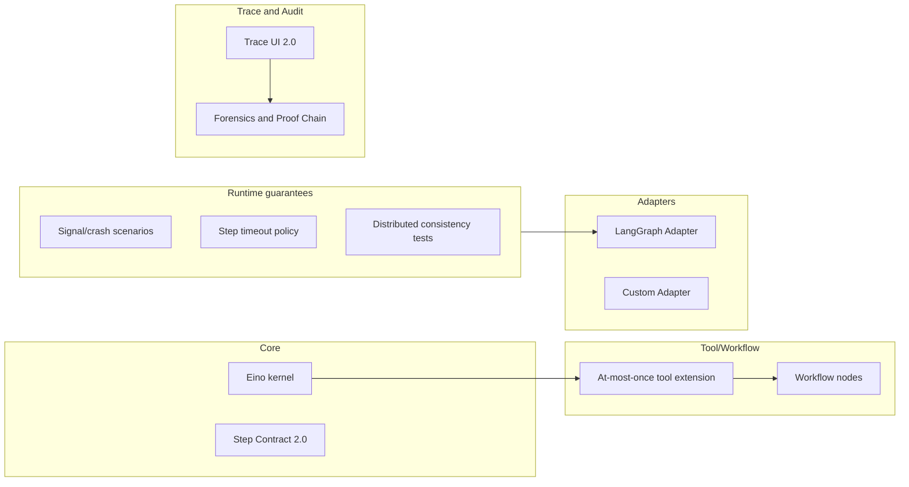

# Aetheris 2.0 — Detailed Roadmap Table

This document is the **task-level execution table** for the 2.0 roadmap. Each row has **Area**, **Task**, **Dependencies**, **Estimate**, **Priority**, and **1.0 vs 2.0** status so you can plan sprints, assign work, and see what builds on what. It complements the [improvement checklist](improvement-checklist-1.0-to-2.0.md) (item-level Risk/Effort/Module) and the [2.0 roadmap timeline](2.0-roadmap-timeline.md) (phases and Gantt).

**Estimate legend**: S ≈ &lt;1 week, M ≈ 1–2 weeks, L ≈ 2+ weeks.

---

## Suggested execution order

1. **Core execution engine** + **Step Contract 2.0**
2. **Tool/Workflow** extension + **Runtime guarantees & reliability**
3. **Adapters** (LangGraph, Custom) + **Trace & Audit**
4. **CLI/DevOps** tooling
5. **Docs & tutorials** upgrade

Within each group, tasks with no dependencies can be parallelized; the table and dependency diagram below show the links.

---

## Roadmap table

| Area | Task | Dependencies | Estimate | Priority | 1.0 vs 2.0 |
|------|------|--------------|----------|----------|------------|
| Core engine | Eino kernel optimization (complex DAG, step parallelism, lease/fencing) | — | L | High | 2.0 New |
| Core engine | Step Contract 2.0 (side-effect control, async events, pluggable StepValidator) | 1.0 Step Contract helper (done) | M | High | 2.0 New |
| Tool/Workflow | At-most-once tool extension (Ledger for async/external APIs, retry/timeout policy) | Core engine | M | High | 1.0 Partial |
| Tool/Workflow | Workflow nodes modularization (built-in wait/approval/condition, custom node registry) | At-most-once tool extension | L | Medium | 2.0 New |
| Adapters | LangGraph Adapter (latest API, error handling and recovery) | Runtime guarantees (replay/signal); adapter doc exists | M | High | 2.0 New |
| Adapters | Custom Agent Adapter enhancement (Imperative → TaskGraph, CLI/SDK) | — | M | Medium | 1.0 Partial |
| Trace & Audit | Trace UI 2.0 (multi-job/agent view, step replay/diff) | — | M | Medium | 1.0 Partial |
| Trace & Audit | Execution Forensics & Proof Chain (cross-worker/DAG audit, RAG/Tool provenance UI) | Trace UI 2.0; design/execution-forensics.md | L | Medium–High | 2.0 New |
| Runtime guarantees | Signal loss and worker crash scenarios (tests and docs) | — | M | High | 1.0 Partial |
| Runtime guarantees | Step timeout and failure policy | — | S–M | High | 1.0 Partial |
| Runtime guarantees | Distributed run consistency tests | Stress tests (done) | M | High | 2.0 New |
| CLI/DevOps | CLI: aetheris migrate, monitor, replay (and/or extend existing replay) | — | M | Medium | 2.0 New |
| CLI/DevOps | CI/CD pipeline 2.0 (multi-env deployment) | — | M | Medium | 2.0 New |
| CLI/DevOps | Makefile/scripts for 2.0 services | — | S | Medium | 1.0 Partial |
| Docs | Getting Started 2.0 (human-in-loop, API orchestration, auditable agent cases) | — | M | Medium–High | 1.0 Partial |
| Docs | Adapter migration guide | — | S | Medium | 1.0 Partial |
| Docs | Step Contract & best practices | — | S | Medium | 1.0 Partial |

---

## Dependency sketch

The following diagram shows the main dependency flow for 2.0 tasks. Items with no incoming edges can start immediately; others wait on the listed prerequisites.

---

## References

- **Item-level checklist (Risk, Effort, Module)**: [docs/improvement-checklist-1.0-to-2.0.md](improvement-checklist-1.0-to-2.0.md)
- **Phase timeline and Gantt**: [docs/2.0-roadmap-timeline.md](2.0-roadmap-timeline.md)
- **2.0 modules and phases**: [design/aetheris-2.0-overview.md](../design/aetheris-2.0-overview.md)
- **1.0 release baseline**: [docs/release-checklist-v1.0.md](release-checklist-v1.0.md)
