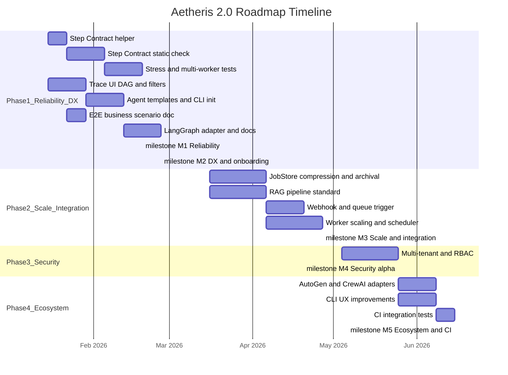

# Aetheris 2.0 Roadmap Timeline

This document is the **actionable 2.0 roadmap timeline** derived from the [improvement checklist](improvement-checklist-1.0-to-2.0.md). It provides phased development order, a Gantt chart, and milestones for sprint or quarter planning. For high-level 2.0 modules and dependency structure, see [design/aetheris-2.0-overview.md](../design/aetheris-2.0-overview.md).

---

## Priority strategy (summary)

| Tier | Focus |
|------|--------|
| **High** | Step Contract reliability, Trace UI, Agent onboarding, Docs and examples |
| **Medium** | Crash and retry extended tests, RAG pipeline, Signal extension, Multi-tenant and security, Performance optimization |
| **Long-term / optional** | Adapter variety, CLI UX, CI coverage enhancement |

Phase 1 below maps to high-priority items; Phases 2–3 to medium; Phase 4 to optional/long-term.

---

## Phase breakdown (development order)

### Phase 1 — Reliability and DX foundation (high priority)

- **Step Contract**: Wrapper/helper so developers are less likely to break the contract; static check or test harness to verify Steps (no direct HTTP, no `time.Now()`/`rand`, side effects via Tools only).
- **Crash and retry**: Stress tests and multi-worker scenarios beyond the four fatal tests to cover edge cases.
- **Trace UI**: Interactive DAG view, step-level folding, event filters, state diff view.
- **Agent onboarding**: Official templates and CLI (e.g. `aetheris init`) to scaffold TaskGraph, tools, and config.
- **Docs**: End-to-end business scenario (e.g. refund-approval) from agent authoring to deployment; adapter examples and LangGraph or custom-adapter ease.

**Milestones**: M1 (Step Contract and reliability baseline), M2 (DX and onboarding ready).

---

### Phase 2 — Scale and integration (medium priority)

- **JobStore / event sourcing**: Event compression, archival strategy, batch query and pagination for large event streams.
- **RAG / knowledge pipeline**: Standardized pipeline adapter and best practices so RAG-dependent agents have a consistent experience.
- **External triggers**: Webhook and queue-based trigger support, extending the current Signal mechanism.
- **Performance**: Worker scaling and scheduler optimization, JobStore performance tuning.

**Milestone**: M3 (scale and integration).

---

### Phase 3 — Security and multi-tenant (medium priority)

- **Multi-tenant and isolation**: JobStore namespace, tenant isolation, and access control for multi-team or multi-agent use.
- **RBAC**: Role-based access control and audit alignment.

**Milestone**: M4 (security alpha).

---

### Phase 4 — Ecosystem and polish (optional / long-term)

- **Adapters**: Additional official adapters (e.g. AutoGen, CrewAI).
- **CLI UX**: Richer CLI (subcommand hints, template generation, log query).
- **CI and tests**: Integration tests for agent run, tool invocation, and replay; optional load tests in CI.

**Milestone**: M5 (ecosystem and CI).

---

## Detailed Gantt chart

The following Gantt chart maps concrete tasks to phases and milestones. Start date is a nominal 2.0 kickoff; adjust dates when scheduling. Task IDs are used for dependencies.

---

## Milestone table

| ID | Name | Criteria | Phase |
|----|------|----------|--------|
| **M1** | Step Contract and reliability | Step Contract helper and static check or test harness in place; stress and multi-worker test suite running. | Phase 1 |
| **M2** | DX and onboarding | Trace UI v2 (DAG view, filters, folding, state diff); agent templates and CLI init; one full-flow business scenario doc; LangGraph or adapter docs improved. | Phase 1 |
| **M3** | Scale and integration | JobStore event compression and archival (or batch/pagination) available; RAG pipeline standard and examples; webhook or queue trigger; Worker scaling and scheduler improvements. | Phase 2 |
| **M4** | Security alpha | Multi-tenant namespace and isolation; RBAC and access control in place (alpha). | Phase 3 |
| **M5** | Ecosystem and CI | Additional adapters (e.g. AutoGen, CrewAI); CLI UX improvements; integration tests and optional load tests running in CI. | Phase 4 |

---

## References

- **Improvement checklist (source table)**: [docs/improvement-checklist-1.0-to-2.0.md](improvement-checklist-1.0-to-2.0.md)
- **2.0 modules and phases**: [design/aetheris-2.0-overview.md](../design/aetheris-2.0-overview.md)
- **Eight-week 2.0 coding plan**: [docs/next_plan.md](next_plan.md)
