# Aetheris 2.0 升级指引与路线图

本文档基于当前代码库现状，汇总 2.0 相关模块的完成度、推荐升级指引、优先级与 2.0 发布判定标准。不修改现有 design 文档正文，仅在此引用并归纳。

---

## 1. 当前状态总结

| 模块 | 状态 | 说明与关键文件 |
|------|------|----------------|
| Event Sourcing / JobStore | 完成 | 每个 Job 的事件持久化，支持 Replay。`internal/runtime/jobstore`、[design/event-replay-recovery.md](../design/event-replay-recovery.md) |
| Step Committed Barrier | 完成 | StepCommitted 事件与写入顺序，确保 step 执行至少一次且 side-effect 不重复。`internal/runtime/jobstore/event.go`、[design/execution-state-machine.md](../design/execution-state-machine.md) |
| Deterministic Replay | 完成 | ReplayGuard、ForbiddenOps、Recorded Effects（Now/UUID/HTTP）。`internal/agent/determinism`、`internal/agent/runtime/effects`、[design/replay-sandbox.md](../design/replay-sandbox.md) |
| Worker Lease / Heartbeat | 完成 | LeaseManager、HeartbeatRunner、Rebalance。`internal/agent/scheduler`、[design/scheduler-correctness.md](../design/scheduler-correctness.md) |
| Signal 持久化 / At-least-once | 完成 | SignalInbox（Append + MarkAcked），JobSignal 先写 inbox 再 Append。`internal/agent/signal`、[design/runtime-contract.md](../design/runtime-contract.md) |
| Side-Effect Ledger | 已有基础 | Effect Store + command_committed + tool_invocation_*；Replay 只注入不执行。[design/effect-system.md](../design/effect-system.md) |
| Observability | 已增强 | CountPending、ListStuckRunningJobIDs、GET /api/observability/summary。`internal/agent/job/observability.go`、[docs/observability.md](observability.md) |
| SDK / Step Contract | 完成（待强化） | step/tool/runtime_context 包与文档；**待强化**：Runner 注入 RecordedEffects / RuntimeContext。`pkg/agent/sdk`、[design/step-contract.md](../design/step-contract.md) |
| Tool 幂等 / RetryPolicy / Compensation | 已定义（待强化） | 类型与契约文档已有；**待强化**：Adapter 使用 RetryPolicy、Runner 接入 CompensationRegistry。[design/tool-contract.md](../design/tool-contract.md)、`internal/agent/runtime/executor/retry.go`、`compensation.go` |

---

## 2. 2.0 Roadmap 流程图

下图按「已实现 → 已实现待强化 → 下一步 → 2.0 标准」标注，便于一眼看出重点。

```mermaid
flowchart LR
  subgraph done [已实现]
    A[Event_Sourcing_JobStore]
    B[Step_Committed_Barrier]
    C[Determinism_ReplayGuard_RecordedEffects]
    D[Scheduler_Lease_Heartbeat_Rebalance]
    E[Signal_Inbox_AtLeastOnce]
    F[Observability_Backlog_Stuck_Summary]
    G[SDK_Step_Tool_RuntimeContext]
    H[Tool_Contract_ID_Retry_Compensation]
  end

  subgraph strengthen [已实现待强化]
    I[Step_Contract_Runner_Inject]
    J[RetryPolicy_in_Adapter]
    K[Compensation_in_Runner]
  end

  subgraph next [下一步可选]
    L[Stuck_Job_UI_Retry_Timeline]
    M[Audit_Forensics_Tool_Trace]
  end

  subgraph criteria [2.0发布标准]
    N[Worker_crash_resume_no_duplicate]
    O[Replay_deterministic]
    P[Tool_at_least_once_verifiable]
    Q[Signal_durable]
    R[Step_Contract_enforced]
    S[Trace_SRE_usable]
  end

  done --> strengthen
  strengthen --> next
  done --> criteria
  strengthen --> criteria
```

- **已实现**：当前仓库已有的 8 块。
- **已实现待强化**：Runner 注入 Step Contract（RecordedEffects/RuntimeContext）、Adapter 使用 RetryPolicy、Runner 接入 CompensationRegistry。
- **下一步可选**：Stuck Job UI、重试时间线可视化、审计/因果追溯（Tool Trace）。
- **2.0 发布标准**：由「已实现 + 待强化」共同满足，见下方判定清单。

---

## 3. 推荐升级指引

按模块块组织，每条标注与现有实现的对应关系。

### 核心可靠性

- **Deterministic Replay Enforcement** — 已实现：`internal/agent/determinism`（replay_guard、forbidden_ops）、`internal/agent/runtime/effects`（Now/UUID/HTTP）。Replay 时未记录的非确定性可被检测/阻断；Step 应仅通过 Runtime 注入的 Clock/UUID/HTTP 做副作用。见 [design/replay-sandbox.md](../design/replay-sandbox.md)。
- **Side-Effect Ledger 完善** — 已有基础：Effect Store、command_committed、tool_invocation_*；Replay 不实际调用外部系统。目标：对所有外部交互形成 EffectID + Result + Committed，At-most-once 外部效果。见 [design/effect-system.md](../design/effect-system.md)。
- **Step Contract Runtime Enforcement** — 已实现 SDK 与文档；待强化：Runner 在调用 step 前注入 `effects.WithRecordedEffects` 与 `sdk.WithRuntimeContext`，限制 step 仅能使用 runtime.Tool() / runtime 时间/UUID/HTTP。见 [design/step-contract.md](../design/step-contract.md)、[docs/sdk.md](sdk.md)。

### 分布式执行

- **Worker Lease & Heartbeat** — 已实现：`internal/agent/scheduler`（LeaseManager、HeartbeatRunner）。每个 Job 由 Worker 租用，超时可重分配。见 [design/scheduler-correctness.md](../design/scheduler-correctness.md)。
- **Crash Recovery / Job Migration** — 已实现：ListJobIDsWithExpiredClaim、ReclaimOrphanedFromEventStore；Worker crash 后 Job 可被其他 Worker Reclaim。需保证 step committed barrier + Ledger 防止重复执行。
- **Scheduler Correctness** — 完善 step timeout、retry、lease fencing 与文档；保证 exactly-once execution 语义。

### Human-in-the-loop / Signal

- **持久化 Signal Inbox** — 已实现：`internal/agent/signal`（inbox + ack），JobSignal 先写 inbox 再 Append wait_completed。见 [design/runtime-contract.md](../design/runtime-contract.md)。
- **At-least-once Delivery** — 已实现：inbox 持久化后即使 API/Worker 崩溃，signal 不丢；ack 与 Append 成功绑定。
- **Integration with Step Contract** — Step 等待 signal 时 checkpoint 与 context 已由现有 Runner/JobStore 支持。

### 运维与可观测性

- **Job Health & Debugging** — 已增强：Stuck job 检测（ListStuckRunningJobIDs）、Queue backlog（CountPending）、GET /api/observability/summary。见 [docs/observability.md](observability.md)。可选下一步：Stuck Job UI、Retry 时间线可视化。
- **Audit & Forensics** — 已有 Trace、reasoning_snapshot、tool_invocation 事件；可扩展为每个 tool 调用可追溯、causal tree 可查询。

### 工具幂等性

- **Tool Invocation ID** — 已定义并暴露：与 idempotency_key / invocation_id 对应，Trace 与事件中统一。见 [design/tool-contract.md](../design/tool-contract.md)、`internal/agent/runtime/executor/retry.go`（ToolInvocationID）。
- **Compensation / RetryPolicy** — 类型与契约已定义（RetryPolicy、CompensationFunc、CompensationRegistry）；待强化：Adapter 使用 RetryPolicy 重试、Runner 在 compensatable_failure 时调用 CompensationRegistry。见 [design/tool-contract.md](../design/tool-contract.md)、`internal/agent/runtime/executor/compensation.go`。

---

## 4. 下一步优先级表

| 优先级 | 模块 | 目标 | 仓库对应 |
|--------|------|------|----------|
| 高 | Deterministic Replay & Step Contract Runtime | 保证 replay 不分叉、step 安全 | 已实现；强化 Runner 注入见 `internal/agent/runtime/executor/runner.go`、`pkg/agent/sdk` |
| 高 | Worker Lease / Crash Recovery | 分布式执行可靠 | `internal/agent/scheduler`、`internal/agent/job/reclaim.go` |
| 中 | Signal Reliability | Human-in-the-loop 场景可用 | `internal/agent/signal`、`internal/api/http/handler.go`（JobSignal） |
| 中 | Side-Effect Ledger 完善 | Replay 安全、外部幂等 | [design/effect-system.md](../design/effect-system.md)、Effect Store 与 Ledger 集成 |
| 低 | Observability & SRE UI | 运维可见性提升 | `internal/agent/job/observability.go`、[docs/observability.md](observability.md)；可选 Stuck Job UI、Retry 时间线 |

---

## 5. 分阶段发布建议

- **Phase 1（Beta）**：核心可靠性 + 分布式执行。即 Deterministic Replay、Step Contract 文档与 SDK、Worker Lease/Heartbeat、Crash Recovery、Step Committed Barrier 与 Ledger 已有；可标记为 2.0-beta，重点验证 Replay 一致性、Worker 迁移、无重复执行。
- **Phase 2（2.0 正式）**：在 Beta 基础上，完成 Step Contract Runtime 注入（Runner）、Signal 持久化与 at-least-once（已实现）、Observability 增强（已实现）；可选完成 RetryPolicy/Compensation 接入与 Stuck Job UI。满足下方 2.0 发布判定清单后发布 2.0。

---

## 6. 2.0 发布判定清单

Aetheris 2.0 可视为完成时，应满足以下标准（可勾选自检）：

- [ ] **Worker crash / job resume 无重复执行** — Lease 过期 + Reclaim + Step Committed Barrier + Ledger 保证
- [ ] **Replay 永远一致（deterministic）** — Recorded Effects 唯一入口、Replay 时仅注入、无未记录非确定性
- [ ] **Tool 调用至少一次执行、结果可验证** — idempotency_key、ToolInvocationID、Effect Store / Ledger
- [ ] **Signal 持久化可靠** — 先写 inbox 再 Append，at-least-once delivery
- [ ] **Step Contract runtime enforcement 完整** — Runner 注入 RecordedEffects/RuntimeContext，Step 仅能通过 Runtime API 做副作用
- [ ] **Job trace 可被 SRE / 业务运维使用** — Trace UI、observability summary、stuck job、queue backlog

---

## 参考

- [design/plan.md](../design/plan.md) — 2.0 实现计划（历史）
- [design/execution-state-machine.md](../design/execution-state-machine.md) — Step 状态与 StepCommitted
- [design/effect-system.md](../design/effect-system.md) — Idempotency、Tool、Replay
- [docs/observability.md](observability.md) — 可观测性 API 与指标
- [docs/sdk.md](sdk.md) — Step Programming Model 与 SDK
